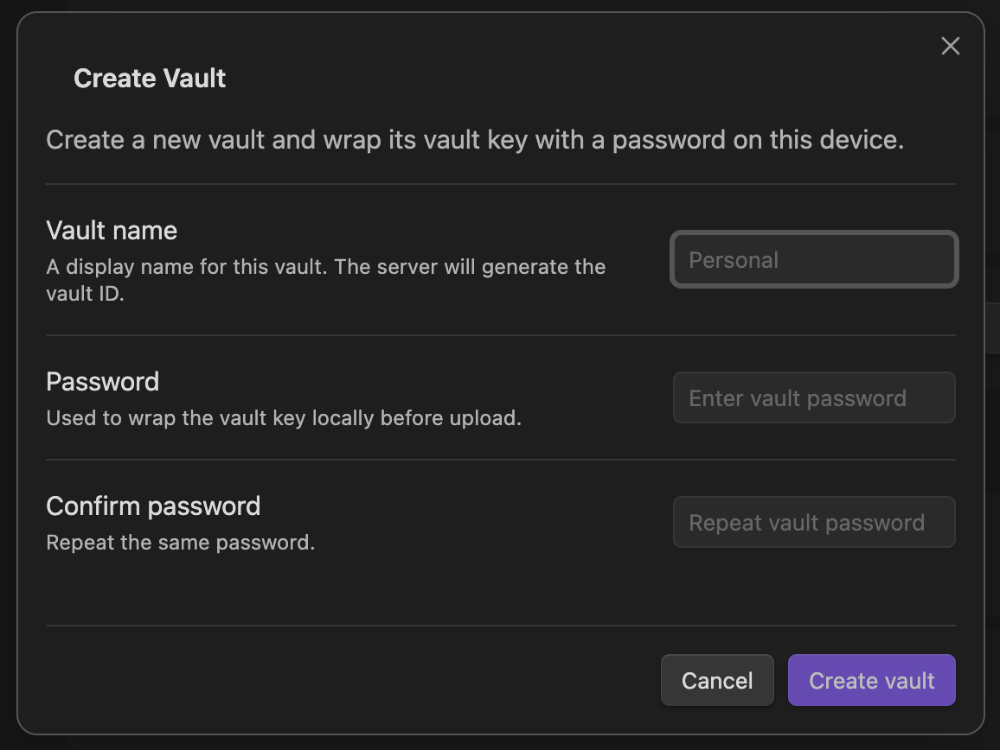
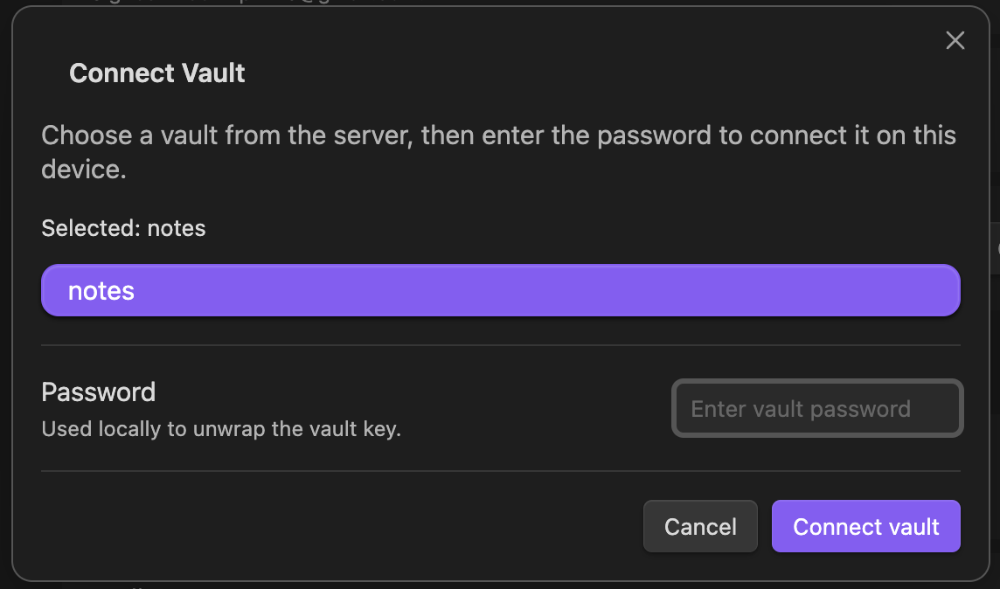

End-to-end encryption means your data is locked before it leaves your device, and it is only unlocked again on one of your devices.

Synch's server helps store and sync your data, but it does not get the secret needed to read it.

Here is the basic idea:

```txt
your device: readable note -> encrypted data
server: stores encrypted data
another device: encrypted data -> readable note
```

Before encryption, a note might look like this:

```txt
Hello, this is my private note.
```

After encryption, it looks like random data:

```txt
K9sV1xQ4...unreadable bytes...
```

To turn that random-looking data back into the original note, a device needs the right key.

## The Main Question

Most of encryption comes down to one question:

> Who has the key?

In Synch, your device has the key. The server stores encrypted data, but it does not receive the plaintext key needed to decrypt that data.

Synch encrypts file contents and file metadata, such as file paths, on your device before upload. Another device can download the encrypted data from the server, but it can only read that data after it unlocks the same vault key locally.

The rest of this article explains how that works.

## Two Secrets, Not One

When you create a remote vault in Synch, you choose a vault password.



It is natural to think that this password directly encrypts all of your files.

It does not.

Instead, Synch uses two different secrets:

```txt
vault password: the password you remember and type
vault key: a random key generated by Synch
```

The vault key is the real key used to encrypt and decrypt your synced vault data.

The vault password has a different job: it protects the vault key, so the vault key can be stored safely and unlocked on your other devices.

An easy way to think about it is:

```txt
vault key = key to your data
vault password = key to unlock the vault key
```

This extra step matters because human passwords are usually not random enough to use directly as strong encryption keys. Even passwords that look strong to a person can be guessed by computers if an attacker gets a chance to try many guesses.

So Synch generates a random 32-byte vault key for the actual data encryption.

```txt
password = "my-strong-password"
vaultKey = "random-32-byte-key"
```

Then Synch protects that vault key with your password.

## Protecting the Vault Key

Synch cannot store the vault key on the server as readable text. If it did, the server could read your encrypted data.

So Synch stores an encrypted copy of the vault key instead.

To do that, Synch first turns your password into a stronger key called a `wrapKey`.

```txt
password + salt + Argon2id settings
=> wrapKey
```

The `wrapKey` is not used to encrypt your files. It is only used to encrypt, or "wrap", the vault key.

Synch uses Argon2id to create the `wrapKey` from your password:

```txt
Argon2id(
  password = "my-strong-password",
  salt = random 16 bytes,
  memory = 64 MiB,
  iterations = 3,
  parallelism = 1
)
=> wrapKey
```

Argon2id is a password-based key derivation function. In plain English, it is a deliberately expensive way to turn a password into an encryption key. That makes password guessing slower for attackers.

The salt is random data stored alongside the encrypted vault key. It is not secret. Its job is to make sure the same password does not always produce the same result in different vaults.

If you enter the same password with the same salt and settings, Synch gets the same `wrapKey` again. If the password is wrong, Synch gets a different `wrapKey`.

Now Synch encrypts the vault key with the `wrapKey`:

```txt
AES-GCM encrypt (
  key = wrapKey,
  nonce = random 12 bytes,
  plaintext = vaultKey
)
=> encrypted vaultKey
```

AES-GCM is the encryption method used here. The nonce is random-looking data needed for encryption. It must be unique, but it does not need to be secret.

At this point, the server can store the encrypted vault key package.

```json
{
  "kdf": {
    "name": "argon2id",
    "memoryKiB": 65536,
    "iterations": 3,
    "parallelism": 1,
    "salt": "b64_salt"
  },
  "wrap": {
    "algorithm": "aes-256-gcm",
    "nonce": "b64_nonce",
    "ciphertext": "b64_encrypted_vaultKey"
  }
}
```

This package tells a Synch client how to try unlocking the vault key later. It does not give the server the password or the vault key.

The server has:

```txt
salt
Argon2id settings
nonce
encrypted vaultKey
```

The server does not have:

```txt
password
wrapKey
vaultKey
```

That difference is the core of Synch's end-to-end encryption design.

## What the Server Can and Cannot See

Because the server does not have the vault key, it cannot read your file contents or decrypted file paths.

The server stores encrypted data and the information needed for your own devices to unlock it after you enter the correct vault password.

End-to-end encryption does not hide everything, though. The server may still see information needed to run the sync service, such as your account, vault identifier, encrypted object sizes, update times, and sync activity.

The important boundary is that the server should not be able to turn your encrypted vault data back into readable notes by itself.

## Encrypting Files and Metadata

After your device unlocks the vault key, Synch uses that vault key as the root secret for synced data.

File contents are encrypted before upload. File metadata, such as file paths, is also encrypted before upload. Each encrypted item uses its own nonce, which is stored with the encrypted data and used during decryption.

The server stores only encrypted data. It does not store plaintext file contents, plaintext file paths, or the vault key.

## Unlocking the Vault on Another Device



When another device connects to the same remote vault, it downloads the encrypted vault key package from the server.

Then you enter the vault password on that device.

Synch uses the stored salt and Argon2id settings to derive the same `wrapKey`:

```txt
Argon2id(password, same salt, same settings)
=> same wrapKey
```

If the password is correct, the device uses that `wrapKey` to decrypt the encrypted vault key:

```txt
AES-GCM decrypt(
  key = wrapKey,
  nonce = stored nonce,
  ciphertext = encrypted vaultKey
)
=> vaultKey
```

Once the device has the vault key, it can decrypt the synced files and metadata locally.

If the password is wrong, the device derives a different `wrapKey`, and decrypting the vault key fails.

## Why Your Vault Password Still Matters

Your vault password does not directly encrypt every file in your vault. It unlocks the vault key, and the vault key encrypts the actual synced data.

That still makes the password very important.

If someone gets a copy of the encrypted vault key package, they can try password guesses against it offline. Argon2id makes each guess more expensive, but it cannot protect a password that is easy to guess.

If you forget the vault password, Synch cannot recover the vault for you. The password is needed to derive the `wrapKey`, and the `wrapKey` is needed to unlock the vault key. Without either one, the encrypted vault data cannot be read.

If you lose the password, the server cannot recover it either. Deriving `wrapKey` starts from your password, and your password itself is never sent to Synch.

In short, the server's role is storing and syncing encrypted vault data; turning it back into readable notes happens entirely on your devices. The secrets needed to read the data never reside on the server.
